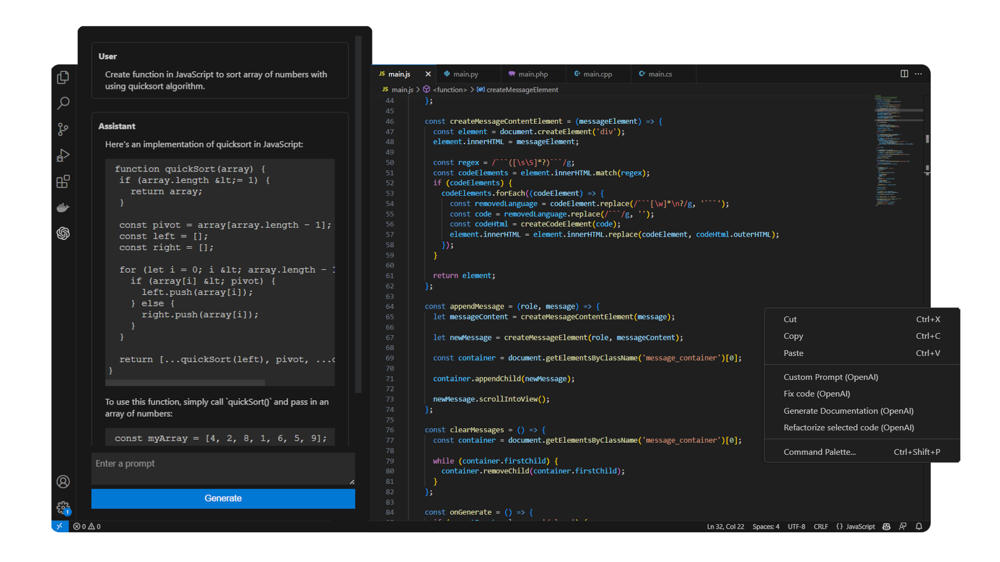
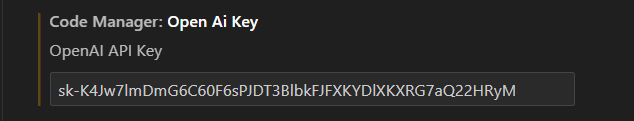
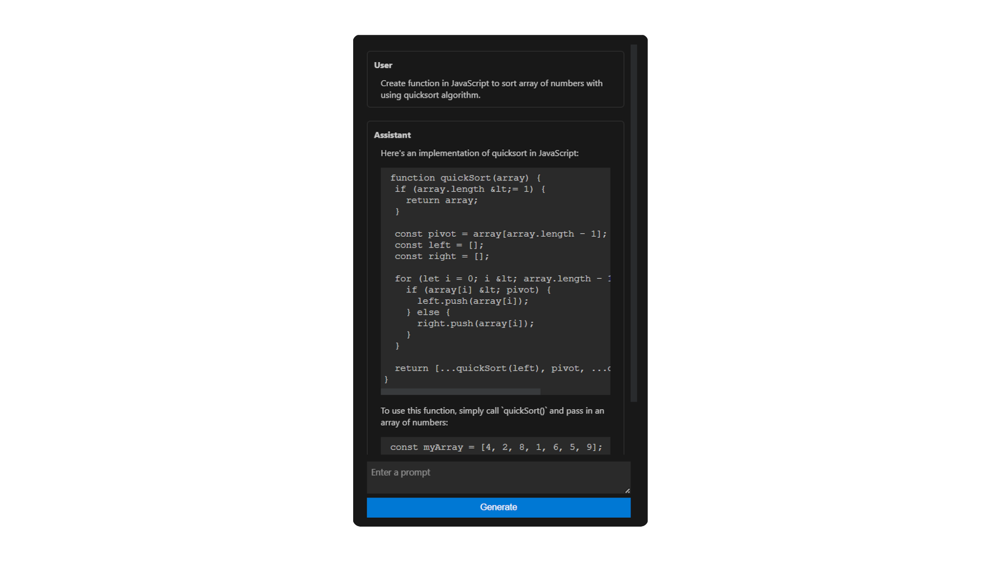
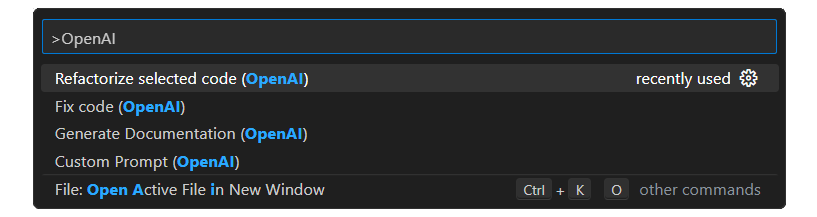
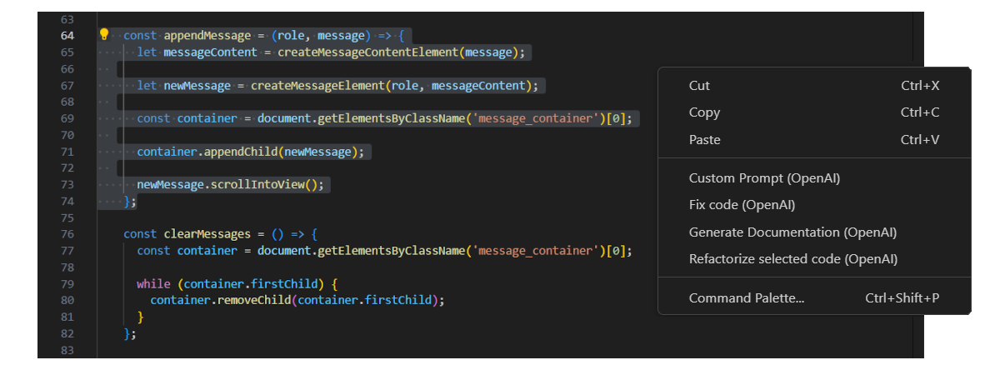
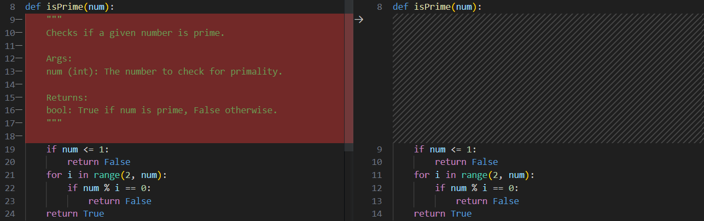

# CodeManager 👨‍💻

CodeManager is a Visual Studio Code extension that leverages the OpenAI GPT-3.5-turbo model to help you efficiently manage your code. It offers a wide range of features including code generation, documentation generation, code fixes, and more.



## Features ✨

- CodeManager can be used with any programming language.
- Fix selected code snippets with ease. ✅
- Generate code based on a custom prompt. 🚀
- Automatically generate documentation for selected code. 📚
- Chat directly with the GPT-3.5-turbo model. 💬

## Setup ⚙️

*Prerequisites*: To use this extension, you'll need an OpenAI API key.

### Configuration

Setting up CodeManager is a breeze. Simply follow these steps:

1. Generate your OpenAI API key from the [OpenAI website](https://platform.openai.com/account/api-keys).

2. Open the extension settings in VS Code and enter your OpenAI API key:

    - `codeManager.openAiKey`: Your OpenAI API key

    

## Usage 🚀

### Chat with the GPT-3.5-turbo model 💬

You can have interactive conversations with the GPT-3.5-turbo model using the chat feature in the sidebar. Simply click on the chat icon to activate it.



### Selected Code Commands ✨

You can use the following commands to generate code, documentation, fix code issues, or customize prompts. These commands can be accessed from the command palette or the context menu (right-click).

- Refactorize Code ✨
- Generate Documentation 📚
- Fix Code ✅
- Customize Prompt 🎨

Command Palette:



Context Menu:



### Output of Generated Code 📄

The generated code is displayed in a diff page where you can review the changes made by the model. You can update the generated code by clicking on the update button.




## Local Development 🛠️

### Prerequisites

- [Node.js](https://nodejs.org/en/)
- [VS Code](https://code.visualstudio.com/)
- [OpenAI API key](https://platform.openai.com/account/api-keys)

### Setup

1. Clone the repository:

    ```bash
    git clone https://github.com/Tostisto/vscode_codemanager.git
    ```
2. Install the dependencies:

    ```bash
    npm install
    ```
3. Build the extension:

    ```bash
    npm run build
    ```
4. Open the repository in VS Code:

    ```bash
    code .
    ```
5. Press `F5` to start the extension in debug mode.

### Build the vsix file

1. Install vsce:

    ```bash
    npm install -g @vscode/vsce
    ```

2. Build the vsix file:

    ```bash
    vsce package
    ```